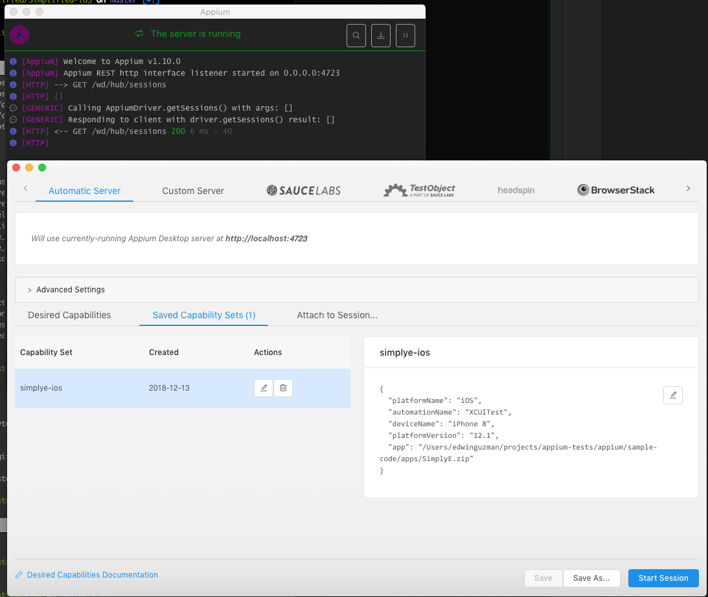
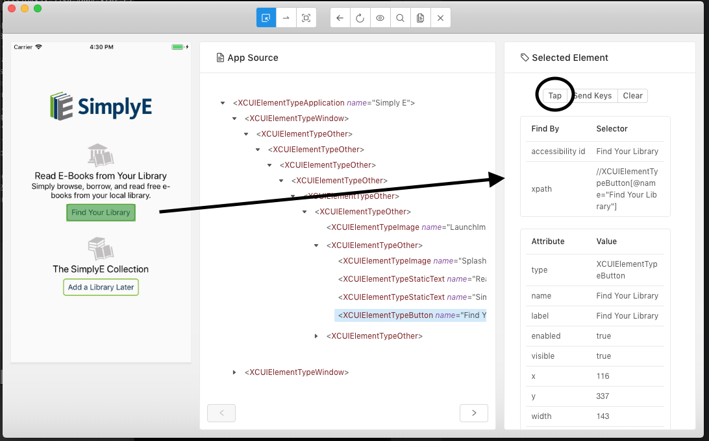

### Appium Installation

Either install through the command line through `npm`

```
npm install -g appium
```

or install the [desktop client](http://appium.io/).

### Appium inspector

* Start the desktop client.
* Connect with the desktop client's inspector to find Accessibility IDs and xpath values using the magnifying glass icon in the top right corner.
* Create a new "Desired Capabilities" object with the following values and make sure to save it for later use.

```
{
  "platformName": "iOS",
  "automationName": "XCUITest",
  "deviceName": "iPhone 8",
  "platformName": "12.1",
  "app": "/Users/[path-to-app-zip-file]/SimplyE.zip"
}
```



* When starting a new session, the app will launch in Appium's simulator and you can click around to view elements on the app, their accessibility id, and xpath values, as well as interact with those elements. Those values can then be used in the regression tests.


